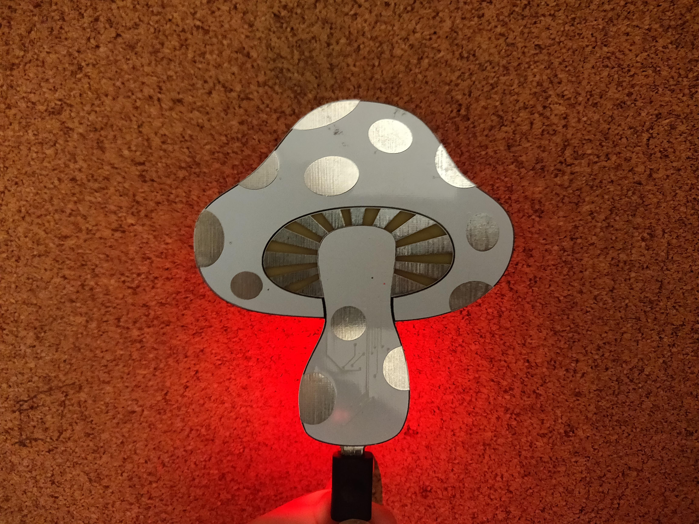
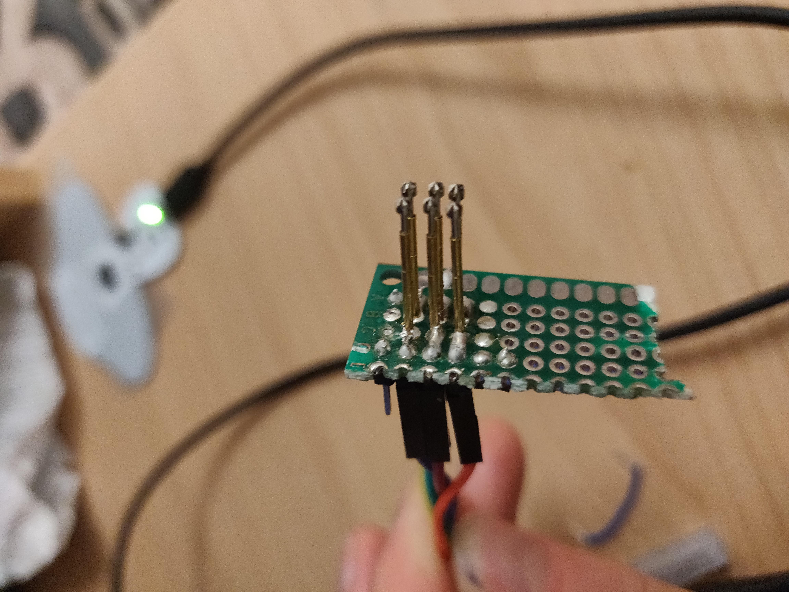

# 🎵🍄 TuneShroom
An artistic capacitive MIDI USB controller - Just a small project to practice artistic PCB design and embedded programming. Find out more on my [website](oliverchild.com/tuneshroom)



## Hardware
The PCB was designed in KiCAD using the wonderful [svg2shenzhen](https://github.com/badgeek/svg2shenzhen) plugin for Inkscape. The circuit is essentially a [Sparkfun Pro Micro](https://www.sparkfun.com/products/12640), thanks Sparkfun for sharing the schematic! It uses an Atmega32u4 with native USB. Each of the IO pins is hooked directly to one of the touch pads on the front and acts as MIDI key.

## Firmware
I started out using Arduino but to access more pins and have more control I decided to go the bare metal approach. The current firmware is a patched version of [LUFA](https://github.com/abcminiuser/lufa) which does all the USB stuff for me. 

## Programming

To compile the firmware go into the [project folder](lufa/Projects/Tuneshroom/) and `make all`.

To Flash it onto the board you need an AVR programmer of some kind and to build a little ISP programmer with some pogo pins.



Some fuses have to be changed from their default using:

```avrdude -c usbasp -p ATmega32u4 -U hfuse:w:0xD8:m -U lfuse:w:0xFF:m -U efuse:w:0xCB:```

Then it's just a case of programming it with:

```avrdude -c usbasp -p ATmega32u4 -U flash:w:TuneShroom.hex```